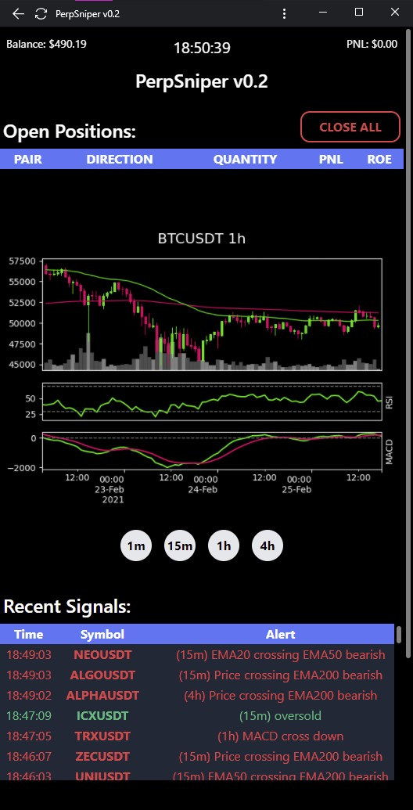
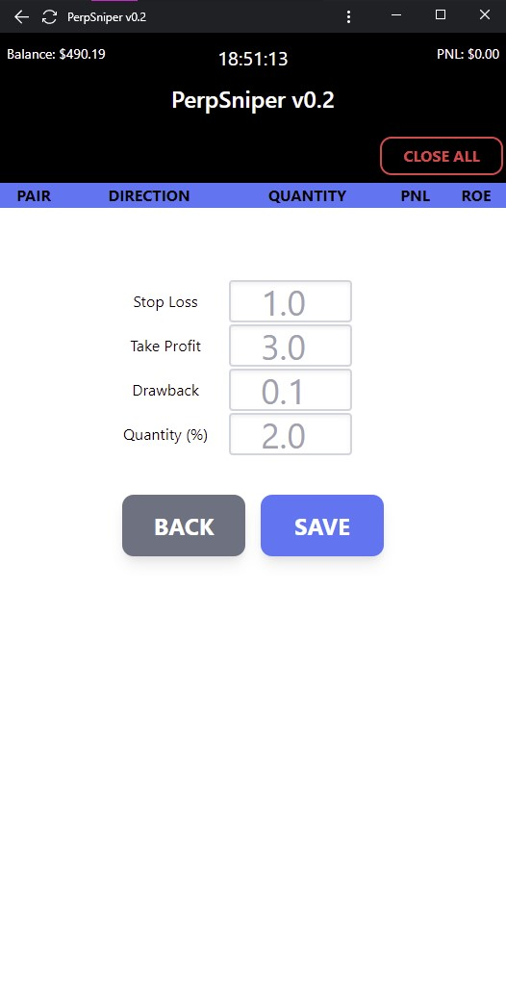

#perpSniper v0.2
###Tools/signals for Binance cryptocurrency derivatives (futures) trading
#####Flask app with standalone gunicorn server (setup_script.py)

##Features:
- automatic stoploss and trailing take-profit orders set when entering a position
- automatic quantity (percentage of balance) set before opening a position
- live charts (2 second update time) showing entry, take-profit and stoploss lines as well as RSI, MACD and 50/200 EMA for 1m, 15m, 1h & 4h timeframes
- signal alerts for volume, macd, rsi overbought/sold, rsi divergence, and ema crosses for 15m, 1h & 4h timeframes