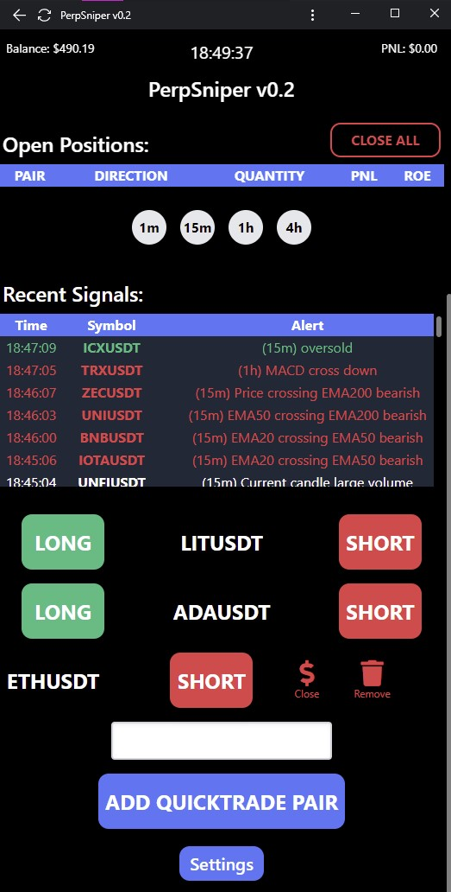

# perpSniper v0.2
### Tools/signals for Binance cryptocurrency derivatives (futures) trading
##### Flask app with standalone gunicorn server (setup_script.py)

## Features:
- automatic stop-loss and trailing take-profit orders set when entering a position
- automatic quantity (percentage of balance) set before opening a position
- live charts (2-second update time) showing entry, take-profit and stop-loss lines as well as RSI, MACD and 50/200 EMA for 1m, 15m, 1h & 4h timeframes
- signal alerts for volume, macd, rsi overbought/sold, rsi divergence, and ema crosses for 15m, 1h & 4h timeframes

## Installation
You will need your Binance api keys. It is recommended to enable IP restriction when setting up keys unless you trust me not to have included a secret script to steal your API keys (I haven't.... or have I??? I haven't but just use the restriction anyway)! From the command line run:

`python setup_script.py`

Use the same command to run the server each time and then log on via your browser to the local IP of the server or localhost with pot 8080 (e.g 192.168.0.10:8080 for different PC or smartphone or 127.0.0.1:8080 (localhost) for same PC as server is running from.)

The server takes a while to start as it has to download the recent symbol data before starting. Also, currently, there is an issue with the background tasks not stopping correctly, you may need to kill the python3.8 process after stopping the server. This will be fixed soon.
